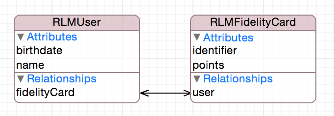
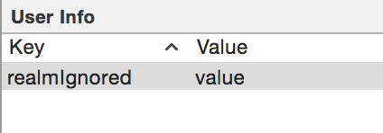
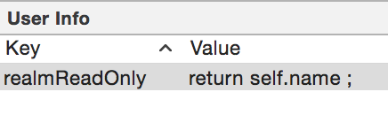
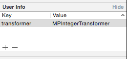

# DBGenerator

Cet outil permet la génération de modèle de base de données pour les plateformes Android et iOS à partir d'un fichier xcdatamodel. Les SGBD supportés pour le moment sont les suivants :
* Realm

---


## Présentation du xcdatamodel

Le fichier xcdatamodel est un fichier xml généré à partir de l'IDE XCode. Il est normalement utilisé pour modéliser les entités CodeData de manière graphique. 



C'est ce fichier xcdatamodel qui est utilisé en entrée du script. 

## Utilisation
	
Le script est à utiliser en ligne de commande, il accepte actuellement les paramètres suivants :

* -m , --model : chemin vers le fichier xcdatamodel - si ce paramètre n'est pas fourni, le script va chercher un fichier xcdatamodel présent dans son répertoire
* -a , --android : chemin vers le répertoire de destination des entités générées Android (eg : home/documents/dev/android/realm_project/com/niji/data)
* -p , --package : le nom complet du package "data" pour Android (eg : com.niji.data)
* -i , --ios : chemin vers le répertoire de destination des entités générées iOS
* -j , --json : permet de générer les catégories Realm-JSON (https://github.com/matthewcheok/Realm-JSON)
* -f , --framework : indique si le projet utilise les Frameworks de CocoaPods 
* -h , --help : affiche l'aide
* -v , --version : affiche le numéro de version du script


### Génération 

xcdatamodel permet d'ajouter des 'user info' aux entités, attributs et relations, sous forme de clé-valeur. Vous pouvez les utiliser afin d'ajouter des informations supplémentaires à vos entités tels que les primary key, les valeurs à ignorer, les correspondances json ...

#### Primary key

Pour indiquer quel attribut sera utilisé comme primary key, vous avez la possibilité d'ajouter la paire clé-valeur suivante à **l'entité** :
**`identityAttribute` : `nom_de_l'attribut`**


__Exemple :__

Sur l'entité 'FidelityCard'  


__Android__  

```
package com.niji.data;

import io.realm.RealmObject;
import io.realm.annotations.PrimaryKey;

/* DO NOT EDIT | Generated by dbgenerator */

public class FidelityCard extends RealmObject {

    @PrimaryKey
    private short identifier;
    private int points;
    private User user;
	[...]
}
```
__iOS__


```
// DO NOT EDIT | Generated by dbgenerator

////////////////////////////////////////////////////////////////////////////////

#pragma mark - Imports

#import "RLMFidelityCard.h"

////////////////////////////////////////////////////////////////////////////////

#pragma mark - Implementation

@implementation RLMFidelityCard

#pragma mark - Superclass Overrides

+ (NSString *)primaryKey
{
    return @"identifier";
}

@end
```

---

#### Ignore attribute

Vous pouvez choisir d'ajouter des attributs qui ne seront pas persistés dans Realm en ajoutant la paire clé-valeur suivante à **l'attribut** : 
**realmIgnored : value**


__Exemple :__

Sur l'attribut 'ignored' de l'entité 'Shop'  


__Android__

```
package com.niji.data;

import io.realm.RealmList;
import io.realm.RealmObject;
import io.realm.annotations.Ignore;

/* DO NOT EDIT | Generated by dbgenerator */

public class Shop extends RealmObject {

    private String name;
    private String readOnly;
    private RealmList<Product> products;
    @Ignore
    private String ignored;
    [...]
}
```
__iOS__


```
// DO NOT EDIT | Generated by dbgenerator

////////////////////////////////////////////////////////////////////////////////

#pragma mark - Imports

#import "RLMShop.h"

////////////////////////////////////////////////////////////////////////////////

#pragma mark - Implementation

@implementation RLMShop

#pragma mark - Superclass Overrides

// Specify properties to ignore (Realm won't persist these)
+ (NSArray *)ignoredProperties
{
    return @[@"ignored"];
}
@end
```

---

#### Read only

Sur iOS vous avez la possibilité d'ajouter des attributs qui ne sont pas persistés et dont la valeur est determinée dynamiquement. Pour ce faire, ajouter la paire clé-valeur suivante à **l'attribut** :
**realmReadOnly : le_code_source_a_generer**


__Exemple :__

Sur l'attribut 'readOnly' de l'entité 'Shop'  


__iOS__


```
// DO NOT EDIT | Generated by dbgenerator

////////////////////////////////////////////////////////////////////////////////

#pragma mark - Imports

#import "RLMShop.h"

////////////////////////////////////////////////////////////////////////////////

#pragma mark - Implementation

@implementation RLMShop

#pragma mark - Superclass Overrides

- (NSString *)readOnly
{
    return self.name;
}

@end
```

---

#### Gérer les enum

Certains attributs de type Int peuvent représenter des enum. Pour gérer ce cas, il faut ajouter les deux paires clé-valeur suivantes à **l'attribut** :
**enumType : mon_type**  
**enumValues : ma_valeur_1,ma_valeur_2,ma_valeur_3** 


__Exemple :__

Sur l'attribut 'type' de l'entité 'shop'  


__Android__

Shop.java  

```
package com.niji.data;

import io.realm.RealmObject;

/* DO NOT EDIT | Generated by dbgenerator */

public class Shop extends RealmObject {

    private String name;
    private Type type;
	[...]
}
```

Type.java

```
package com.niji.data;

/* DO NOT EDIT | Generated by dbgenerator */

public enum Type {

    TYPE_ONE,
    TYPE_TWO,
    TYPE_THREE
}
```

__iOS__

RLMShop.h

```
// DO NOT EDIT | Generated by dbgenerator

////////////////////////////////////////////////////////////////////////////////

#pragma mark - Imports

#import <Realm/Realm.h>
#import "RLMTypes.h"

////////////////////////////////////////////////////////////////////////////////

#pragma mark - Interface

@interface RLMShop : RLMObject

#pragma mark - Properties

@property NSString *name;
@property RLMType type;

@end
```

RLMTypes.h

```
// DO NOT EDIT | Generated by dbgenerator

////////////////////////////////////////////////////////////////////////////////

#pragma mark - Types

typedef NS_ENUM(int, RLMType) {
    RLMTypeOne = 0,
    RLMTypeTwo,
    RLMTypeThree
};
```

> **Remarque** : Sur Android, chaque enum est créée dans un fichier qui lui est propre. Sur iOS toutes les enums sont créées dans le fichier RLMTypes.h

#### Commenter les classes

A des fins de clareté, il est possible de rajouter un commentaire sur une entité, pour permettre de fournir une petite description du rôle de cet entité par exemple.

Pour cela, il suffit de rajouter la paire clé-valeur **`comment` : `texte_du_commentaire`** à votre **entité** du xcdatamodel.

Un commentaire de code (`/** … */`) sera généré dans le `.h` (iOS) ou le `.java` (Android) juste avant la déclaration de la classe, pour aider le développeur à comprendre son but en relisant le doc (ou s'il générait la documentation Javadoc/Doxygen).

---

#### Mapping json

Vous pouvez également ajouter la correspondance json pour chaque **attribut** ou **relationship** avec la paire clé-valeur : **`JSONKeyPath` : `valeur_json`**

__Exemple :__

Sur l'attribut 'name' de l'entité 'Shop'  


__Android__

Sur Android, nous utilisons la librairie GSON

```
package com.niji.data;

import com.google.gson.annotations.SerializedName;

import io.realm.RealmList;
import io.realm.RealmObject;

/* DO NOT EDIT | Generated by dbgenerator */

public class Shop extends RealmObject {

    @SerializedName("json_name")
    private String name;
    private RealmList<Product> products;
	[...]
}
```
__iOS__

Sur iOS nous utilisons la librairie Realm-JSON en génèrant les catégories MonEntité+JSON


RLMShop+JSON.m

```
// DO NOT EDIT | Generated by dbgenerator

////////////////////////////////////////////////////////////////////////////////

#pragma mark - Imports

#import "RLMShop+JSON.h"

////////////////////////////////////////////////////////////////////////////////

#pragma mark - Implementation

@implementation RLMShop (JSON)

+ (NSDictionary *)JSONInboundMappingDictionary
{
    return @{
        @"json_name" : @"name"
    };
}

+ (NSDictionary *)JSONOutboundMappingDictionary
{
    return @{
        @"name" : @"json_name"
    };
}

@end
```

Cela fonctionne également avec les enum :  
**JSONValues : valeur_json_1,valeur_json_2,valeur_json_3**

Exemple :  


__Android__


```
package com.niji.data;

import com.google.gson.annotations.SerializedName;

/* DO NOT EDIT | Generated by dbgenerator */

public enum Type {

    @SerializedName("json_type_one")TYPE_ONE,
    @SerializedName("json_type_two")TYPE_TWO,
    @SerializedName("json_type_three")TYPE_THREE
}
```

__iOS__


RLMShop+JSON.m

```
// DO NOT EDIT | Generated by dbgenerator

////////////////////////////////////////////////////////////////////////////////

#pragma mark - Imports

#import "RLMShop+JSON.h"
#import "RLMTypes.h"

////////////////////////////////////////////////////////////////////////////////

#pragma mark - Implementation

@implementation RLMShop (JSON)

+ (NSValueTransformer *)typeJSONTransformer
{
    return [MCJSONValueTransformer valueTransformerWithMappingDictionary:@{
        @"json_type_one" : @(RLMTypeOne),
        @"json_type_two" : @(RLMTypeTwo),
        @"json_type_three" : @(RLMTypeThree)
    }];
}

@end
```

#### ValueTransformers Custom

Uniquement disponible sur iOS (Android utilise la libraire GSON), les ValueTransformers custom permettent par exemple de convertir un string en un int. Voici la procédure pour les utiliser : 

- Créer votre ValueTransformers custom en créant une classe héritant de NSValueTransformer dans votre projet.


- Sélectionner maintenant l'attribut qui utilisera le valueTransformer. Dans le user info avec la clé **transformer** et fournissez-lui le nom de la classe du ValueTransformer

Exemple :  


Le générateur produira alors le code suivant. Dans l'exemple, les attributs attrDouble et attrInteger32 n'ont pas la clé **transformer** renseignée.

```
// DO NOT EDIT | Generated by dbgenerator

////////////////////////////////////////////////////////////////////////////////

#pragma mark - Imports

#import "RLMShop+JSON.h"
#import "MPDecimalTransformer.h"
#import "MPIntegerTransformer.h"

////////////////////////////////////////////////////////////////////////////////

#pragma mark - Implementation

@implementation RLMShop (JSON)

+ (NSDictionary *)JSONInboundMappingDictionary
{
    return @{
        @"attrDecimal" : @"attrDecimal",
        @"attrDouble" : @"attrDouble",
        @"attrFloat" : @"attrFloat",
        @"attrInteger16" : @"attrInteger16",
        @"attrInteger32" : @"attrInteger32",
        @"attrInteger64" : @"attrInteger64"
    };
}

+ (NSDictionary *)JSONOutboundMappingDictionary
{
    return @{
        @"attrDecimal" : @"attrDecimal",
        @"attrDouble" : @"attrDouble",
        @"attrFloat" : @"attrFloat",
        @"attrInteger16" : @"attrInteger16",
        @"attrInteger32" : @"attrInteger32",
        @"attrInteger64" : @"attrInteger64"
    };
}

+ (NSValueTransformer *)attrDecimalJSONTransformer
{
    return [[MPDecimalTransformer alloc] init];
}

+ (NSValueTransformer *)attrFloatJSONTransformer
{
    return [[MPDecimalTransformer alloc] init];
}

+ (NSValueTransformer *)attrInteger16JSONTransformer
{
    return [[MPIntegerTransformer alloc] init];
}

+ (NSValueTransformer *)attrInteger64JSONTransformer
{
    return [[MPIntegerTransformer alloc] init];
}

@end

```


