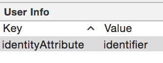
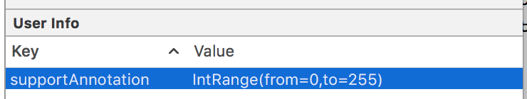
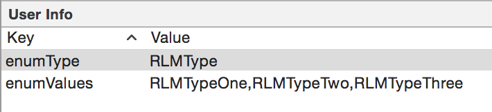
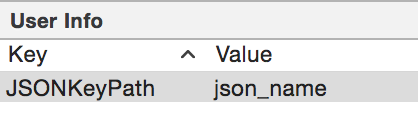

# DBGenerator

DBGenerator is a tool that generates Realm.io classes, for both Android and iOS/macOS, from an `.xcdatamodel` file.
<!--Cet outil permet la génération de modèle de base de données pour les plateformes Android et iOS à partir d'un fichier xcdatamodel. Les SGBD supportés pour le moment sont les suivants 

* Realm
:-->
---


## What is xcdatamodel

The `.xcdatamodel` is an XML file, generated by [Xcode](https://en.wikipedia.org/wiki/Xcode). It encodes the CoreData entities and can be created or edited with a graphical user interface in Xcode.


This `.xcdatamodel` file is the input of the script.

<!--

## Présentation du xcdatamodel

Le fichier `xcdatamodel` est un fichier xml généré à partir de l'IDE XCode. Il est normalement utilisé pour modéliser les entités CodeData de manière graphique. 


C'est ce fichier `xcdatamodel` qui est utilisé en entrée du script. 

-->

## How to use it

DBGenerator is a command line tool. The parameters are:

| Short flag | Long flag | Description |
| ---------- | --------- | ----------- |
| `-m` | `--model` | path to the  `.xcdatamodel` file. If this parameter is not given, DBGenerator looks for a `.xcdatamodel` |
| `-a` | `--android` | path to the directory where the generated files for Android will be created (eg : home/documents/dev/android/realm_project/com/niji/data) |
| `-p` | `--package` | full name of the Android "data" package (eg : com.niji.data) |
| `-i` | `--ios` | path to the directory where the generated files for iOS/macOS will be created |
| `-j` | `--json` | creates the Realm-JSON categories (https://github.com/matthewcheok/Realm-JSON) |
| `-f` | `--framework` | tells whether the project uses the CocoaPods Frameworks  |
| `-s` | `--swift` | if you use Swift as iOS/macOS language |
| `-n` | `--nsnumber` | to generate `NSNumber`s instead of Int/BOOL/Float types |
| `-w` | `--wrappers` | to use type wrappers for Java (Integer, Double,...) for optional attributes instead of primitive types (int, double...) |
| `-x` | `--annotations` | to annotate the getters/setters of the generates classes with `@Nullable` if the attribute/relationship is optional, or `@NonNull` if the attribute/relationship is non-optional |
| `-h` | `--help` | prints help |
| `-v` | `--version` | prints the current version number of DBGenerator |

<!--

## Utilisation
	
Le script est à utiliser en ligne de commande, il accepte actuellement les paramètres suivants :

| Flag court | Flag long | Description |
| ---------- | --------- | ----------- |
| `-m` | `--model` | chemin vers le fichier xcdatamodel - si ce paramètre n'est pas fourni, le script va chercher un fichier xcdatamodel présent dans son répertoire |
| `-a` | `--android` | chemin vers le répertoire de destination des entités générées Android (eg : home/documents/dev/android/realm_project/com/niji/data) |
| `-p` | `--package` | le nom complet du package "data" pour Android (eg : com.niji.data) |
| `-i` | `--ios` | chemin vers le répertoire de destination des entités générées iOS |
| `-j` | `--json` | permet de générer les catégories Realm-JSON (https://github.com/matthewcheok/Realm-JSON) |
| `-f` | `--framework` | indique si le projet utilise les Frameworks de CocoaPods |
| `-s` | `--swift` | If you use Swift as iOS/macOS language |
| `-n` | `--nsnumber` | To generate NSNumbers instead of Int/BOOL/Float types |
| `-w` | `--wrappers` | Permet d'utiliser des wrappers types Java (Integer, Double) sur les attributs optionnels en lieu et place des types primitifs (int, double...) |
| `-x` | `--annotations` | Permet de marquer les getters/setters des champs de classe avec l'annotation @Nullable si l'attribut ou la relation est optionnel, ou @NonNull si l'attribut ou la relation est obligatoire |
| `-h` | `--help` | affiche l'aide |
| `-v` | `--version` | affiche le numéro de version du script |


-->

### Génération 

L'éditeur de `xcdatamodel` permet d'ajouter des 'user info' aux entités, attributs et relations, sous forme de clé-valeur. Vous pouvez les utiliser afin d'ajouter des informations supplémentaires à vos entités tels que les primary key, les valeurs à ignorer, les correspondances json ...

#### Primary key

Pour indiquer quel attribut sera utilisé comme primary key, vous avez la possibilité d'ajouter la paire clé-valeur suivante à **l'entité** :
**`identityAttribute` : `nom_de_l'attribut`**


__Exemple :__

Sur l'entité 'FidelityCard'  


__Android__  

```
package com.niji.data;

import io.realm.RealmObject;
import io.realm.annotations.PrimaryKey;

/* DO NOT EDIT | Generated by dbgenerator */

public class FidelityCard extends RealmObject {

    @PrimaryKey
    private short identifier;
    private int points;
    private User user;
	[...]
}
```
__iOS__


```
// DO NOT EDIT | Generated by dbgenerator

////////////////////////////////////////////////////////////////////////////////

#pragma mark - Imports

#import "RLMFidelityCard.h"

////////////////////////////////////////////////////////////////////////////////

#pragma mark - Implementation

@implementation RLMFidelityCard

#pragma mark - Superclass Overrides

+ (NSString *)primaryKey
{
    return @"identifier";
}

@end
```

---

#### Ignore attribute

Vous pouvez choisir d'ajouter des attributs qui ne seront pas persistés dans Realm en ajoutant la paire clé-valeur suivante à **l'attribut** : 
**realmIgnored : value**


__Exemple :__

Sur l'attribut 'ignored' de l'entité 'Shop'  


__Android__

```
package com.niji.data;

import io.realm.RealmList;
import io.realm.RealmObject;
import io.realm.annotations.Ignore;

/* DO NOT EDIT | Generated by dbgenerator */

public class Shop extends RealmObject {

    private String name;
    private String readOnly;
    private RealmList<Product> products;
    @Ignore
    private String ignored;
    [...]
}
```
__iOS__


```
// DO NOT EDIT | Generated by dbgenerator

////////////////////////////////////////////////////////////////////////////////

#pragma mark - Imports

#import "RLMShop.h"

////////////////////////////////////////////////////////////////////////////////

#pragma mark - Implementation

@implementation RLMShop

#pragma mark - Superclass Overrides

// Specify properties to ignore (Realm won't persist these)
+ (NSArray *)ignoredProperties
{
    return @[@"ignored"];
}
@end
```

---

#### Read only

Sur iOS vous avez la possibilité d'ajouter des attributs qui ne sont pas persistés et dont la valeur est determinée dynamiquement. Pour ce faire, ajouter la paire clé-valeur suivante à **l'attribut** :
**realmReadOnly : le_code_source_a_generer**


__Exemple :__

Sur l'attribut 'readOnly' de l'entité 'Shop'  


__iOS__


```
// DO NOT EDIT | Generated by dbgenerator

////////////////////////////////////////////////////////////////////////////////

#pragma mark - Imports

#import "RLMShop.h"

////////////////////////////////////////////////////////////////////////////////

#pragma mark - Implementation

@implementation RLMShop

#pragma mark - Superclass Overrides

- (NSString *)readOnly
{
    return self.name;
}

@end
```

---

#### Relationships Inverses

En realm, quand on a une RelationShip A -> B et une B -> A, il faut en choisir une qui est la principale (par exemple A -> B) et la relation inverse sera alors **calculée**. [Pour plus d'infos, voir la doc Realm Swift sur les Inverse Relationships](https://realm.io/docs/swift/latest/#inverse-relationships).

Pour marquer une relationship comme étant la relation inverse (la relation B -> A et non pas la relation principale A -> B), il suffit de suffixer le nom de la relationship par un underscore `_`.

> Cela génèrera alors en Swift le code utilisant `LinkingObjects(fromType: A.self, property: "b")` pour la relation inverse en question.
> 
> Si votre relation inverse est vers un unique objet (inverse d'une relation `1-*` par exemple, et non d'une relation `*-*`), le code généré contiendra à la fois une version au pluriel et une computed variable au singulier, par exemple:
> 
> ```swift
> let owners = LinkingObjects(fromType: Person.self, property: "dogs")`
> var owner: Person? { return owners.first }
> ```

---

#### Champs optionnels et wrapper types

Sur Android, le flag de génération `-w` ou `--wrappers` permet de générer les champs marqué comme optionnels avec des wrapper-types en lieu et place des types primitifs.

__Android__

Shop.java

__Android__

```
package com.niji.data;

import io.realm.RealmObject;
import io.realm.annotations.PrimaryKey;

/* DO NOT EDIT | Generated by dbgenerator */

public class FidelityCard extends RealmObject {

    @PrimaryKey
    private short identifier;   // case "optional" non cochée dans le xcdatamodel
    private Integer points;     // case "optional" cochée dans le xcdatamodel
    private User user;
	[...]
}
```

#### Annotations de support

Sur Android, le flag `-x` ou `--annotations` permet de marquer les getters et setters des attributs de classe avec les annotations `@Nullable` si l'attribut est optionnel, ou `@NonNull` s'il ne l'est pas.
Cette option peut être combinée avec celle des wrappers pour obtenir un code qui soit le plus sécurisé à l'utilisation dans Android Studio.

__Android__

Shop.java

__Android__

```
package com.niji.data;

import io.realm.RealmObject;
import io.realm.annotations.PrimaryKey;

/* DO NOT EDIT | Generated by dbgenerator */

public class FidelityCard extends RealmObject {

    @PrimaryKey
    private short identifier;   // case "optional" non cochée dans le xcdatamodel
    private Integer points;     // case "optional" cochée dans le xcdatamodel
    private User user;
	[...]

	@android.support.annotation.Nullable
	public Integer getPoints() {
	    return points;
	}

	public void setPoints(@android.support.annotation.Nullable final Integer points) {
	    this.points = points;
	}

}
```

De plus, il est possible d'ajouter des annotations personnalisées à vos champs. Pour cela, il faut ajouter la paire clévaleur suivante à l'attribut à annoter:

**supportAnnotation : AnnotationAAjouter**

__Exemple :__

Si l'on veut rajouter l'annotation `IntRange(from=0,to=255)`:


__Android__

FidelityCard.java

```java
package fr.ganfra.realm;

import io.realm.RealmObject;

/* DO NOT EDIT | Generated by dbgenerator */

public class FidelityCard extends RealmObject {

    public interface Attributes {
        String IDENTIFIER = "identifier";
        String POINTS = "points";
    }

    private short identifier;
    @android.support.annotation.IntRange(from=0,to=255)
    private int points;

    public short getIdentifier() {
        return identifier;
    }

    public void setIdentifier(final short identifier) {
        this.identifier = identifier;
    }

    @android.support.annotation.IntRange(from=0,to=255)
    public int getPoints() {
        return points;
    }

    public void setPoints(@android.support.annotation.IntRange(from=0,to=255) final int points) {
        this.points = points;
    }
}
```


#### Gérer les enum

Certains attributs de type Int peuvent représenter des enum. Pour gérer ce cas, il faut ajouter les deux paires clé-valeur suivantes à **l'attribut** :

**enumType : mon_type**  
**enumValues : ma_valeur_1,ma_valeur_2,ma_valeur_3** 


__Exemple :__

Sur l'attribut 'type' de l'entité 'shop'  


__Android__

Shop.java  

```java
package com.niji.data;

import io.realm.RealmObject;

/* DO NOT EDIT | Generated by dbgenerator */

public class Shop extends RealmObject {

    private String name;
    private Type type;
	[...]
}
```

Type.java

```java
package com.niji.data;

/* DO NOT EDIT | Generated by dbgenerator */

public enum Type {

    TYPE_ONE,
    TYPE_TWO,
    TYPE_THREE
}
```

__ObjC__

RLMShop.h

```objc
// DO NOT EDIT | Generated by dbgenerator

////////////////////////////////////////////////////////////////////////////////

#pragma mark - Imports

#import <Realm/Realm.h>
#import "RLMTypes.h"

////////////////////////////////////////////////////////////////////////////////

#pragma mark - Interface

@interface RLMShop : RLMObject

#pragma mark - Properties

@property NSString *name;
@property RLMType type;

@end
```

RLMTypes.h

```objc
// DO NOT EDIT | Generated by dbgenerator

////////////////////////////////////////////////////////////////////////////////

#pragma mark - Types

typedef NS_ENUM(int, RLMType) {
    RLMTypeOne = 0,
    RLMTypeTwo,
    RLMTypeThree
};
```

__Swift__

Shop.swift

```swift
/* DO NOT EDIT | Generated by dbgenerator */

import RealmSwift

final class Shop: Object {

    enum Attributes: String {
        case Name = "name"
        case OptionalValue = "optionalValue"
        case Type = "type"
    }

    dynamic var name: String = ""
    dynamic var optionalValue: String? = nil
    var optionalValueEnum: OptValue? {
        get {
            guard let optionalValue = optionalValue,
              let enumValue = OptValue(rawValue: optionalValue)
              else { return nil }
            return enumValue
        }
        set { optionalValue = newValue?.rawValue ?? nil }
    }

    dynamic var type: String = ""
    var typeEnum: Type? {
        get {
            guard let enumValue = Type(rawValue: type) else { return nil }
            return enumValue
        }
        set { type = newValue?.rawValue ?? "" }
    }
}
```

Type.swift

```swift
/* DO NOT EDIT | Generated by dbgenerator */

enum Type: String {
    case TypeOne = "type_one"
    case TypeTwo = "type_two"
    case TypeThree = "type_three"
}
```

OptValue.swift

```swift
/* DO NOT EDIT | Generated by dbgenerator */

enum OptValue: String {
    case OptValueOne = "opt_value_one"
    case OptValueTwo = "opt_value_two"
    case OptValueThree = "opt_value_three"
}
```

> **Remarque** : Sur Android et Swift, chaque enum est créée dans un fichier qui lui est propre. Sur ObjC toutes les enums sont créées dans le fichier RLMTypes.h

#### Commenter les classes

A des fins de clareté, il est possible de rajouter un commentaire sur une entité, pour permettre de fournir une petite description du rôle de cet entité par exemple.

Pour cela, il suffit de rajouter la paire clé-valeur **`comment` : `texte_du_commentaire`** à votre **entité** du xcdatamodel.

Un commentaire de code (`/** … */`) sera généré dans le `.h` (iOS) ou le `.java` (Android) juste avant la déclaration de la classe, pour aider le développeur à comprendre son but en relisant le doc (ou s'il générait la documentation Javadoc/Doxygen).

---

#### Mapping json

Vous pouvez également ajouter la correspondance json pour chaque **attribut** ou **relationship** avec la paire clé-valeur : **`JSONKeyPath` : `valeur_json`**

__Exemple :__

Sur l'attribut 'name' de l'entité 'Shop'  


__Android__

Sur Android, nous utilisons la librairie GSON

```
package com.niji.data;

import com.google.gson.annotations.SerializedName;

import io.realm.RealmList;
import io.realm.RealmObject;

/* DO NOT EDIT | Generated by dbgenerator */

public class Shop extends RealmObject {

    @SerializedName("json_name")
    private String name;
    private RealmList<Product> products;
	[...]
}
```
__iOS__

Sur iOS nous utilisons la librairie Realm-JSON en génèrant les catégories MonEntité+JSON


RLMShop+JSON.m

```
// DO NOT EDIT | Generated by dbgenerator

////////////////////////////////////////////////////////////////////////////////

#pragma mark - Imports

#import "RLMShop+JSON.h"

////////////////////////////////////////////////////////////////////////////////

#pragma mark - Implementation

@implementation RLMShop (JSON)

+ (NSDictionary *)JSONInboundMappingDictionary
{
    return @{
        @"json_name" : @"name"
    };
}

+ (NSDictionary *)JSONOutboundMappingDictionary
{
    return @{
        @"name" : @"json_name"
    };
}

@end
```

Cela fonctionne également avec les enum :  
**JSONValues : `valeur_json_1`, `valeur_json_2`, `valeur_json_3`**

Exemple :  


__Android__


```
package com.niji.data;

import com.google.gson.annotations.SerializedName;

/* DO NOT EDIT | Generated by dbgenerator */

public enum Type {

    @SerializedName("json_type_one")TYPE_ONE,
    @SerializedName("json_type_two")TYPE_TWO,
    @SerializedName("json_type_three")TYPE_THREE
}
```

__iOS__


RLMShop+JSON.m

```
// DO NOT EDIT | Generated by dbgenerator

////////////////////////////////////////////////////////////////////////////////

#pragma mark - Imports

#import "RLMShop+JSON.h"
#import "RLMTypes.h"

////////////////////////////////////////////////////////////////////////////////

#pragma mark - Implementation

@implementation RLMShop (JSON)

+ (NSValueTransformer *)typeJSONTransformer
{
    return [MCJSONValueTransformer valueTransformerWithMappingDictionary:@{
        @"json_type_one" : @(RLMTypeOne),
        @"json_type_two" : @(RLMTypeTwo),
        @"json_type_three" : @(RLMTypeThree)
    }];
}

@end
```

#### ValueTransformers Custom

Uniquement disponible sur iOS (Android utilise la libraire GSON), les ValueTransformers custom permettent par exemple de convertir un string en un int. Voici la procédure pour les utiliser : 

- Créer votre ValueTransformers custom en créant une classe héritant de NSValueTransformer dans votre projet.


- Sélectionner maintenant l'attribut qui utilisera le valueTransformer. Dans le user info avec la clé **transformer** et fournissez-lui le nom de la classe du ValueTransformer

Exemple :  


Le générateur produira alors le code suivant. Dans l'exemple, les attributs attrDouble et attrInteger32 n'ont pas la clé **transformer** renseignée.

```
// DO NOT EDIT | Generated by dbgenerator

////////////////////////////////////////////////////////////////////////////////

#pragma mark - Imports

#import "RLMShop+JSON.h"
#import "MPDecimalTransformer.h"
#import "MPIntegerTransformer.h"

////////////////////////////////////////////////////////////////////////////////

#pragma mark - Implementation

@implementation RLMShop (JSON)

+ (NSDictionary *)JSONInboundMappingDictionary
{
    return @{
        @"attrDecimal" : @"attrDecimal",
        @"attrDouble" : @"attrDouble",
        @"attrFloat" : @"attrFloat",
        @"attrInteger16" : @"attrInteger16",
        @"attrInteger32" : @"attrInteger32",
        @"attrInteger64" : @"attrInteger64"
    };
}

+ (NSDictionary *)JSONOutboundMappingDictionary
{
    return @{
        @"attrDecimal" : @"attrDecimal",
        @"attrDouble" : @"attrDouble",
        @"attrFloat" : @"attrFloat",
        @"attrInteger16" : @"attrInteger16",
        @"attrInteger32" : @"attrInteger32",
        @"attrInteger64" : @"attrInteger64"
    };
}

+ (NSValueTransformer *)attrDecimalJSONTransformer
{
    return [[MPDecimalTransformer alloc] init];
}

+ (NSValueTransformer *)attrFloatJSONTransformer
{
    return [[MPDecimalTransformer alloc] init];
}

+ (NSValueTransformer *)attrInteger16JSONTransformer
{
    return [[MPIntegerTransformer alloc] init];
}

+ (NSValueTransformer *)attrInteger64JSONTransformer
{
    return [[MPIntegerTransformer alloc] init];
}

@end

```


